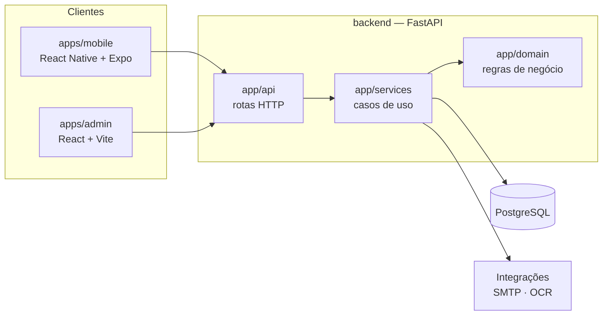

# APETIT-APP

Plataforma corporativa **em desenvolvimento** para digitalizar a experiência de alimentação em unidades atendidas pela APETIT.

O projeto reúne aplicação mobile para colaboradores, painel administrativo e API para gestão de cardápios, usuários, feedbacks, refeições, prescrições e fichas técnicas.


> ### Onde está o código
>
> A implementação atual está na branch **`foundation/v1`**, que passa por processo de validação/homologação antes da consolidação no `main`.
>
> Este `main` funciona como página de apresentação técnica do projeto. Ele **não** contém a implementação — o merge acontecerá quando o projeto estiver tecnicamente pronto conforme o fluxo definido, não para efeito de vitrine.
>
> [Ver o código em `foundation/v1`](https://github.com/VmaffeiDev/APETIT-APP/tree/foundation/v1)

---

## Visão geral

Em operações de alimentação corporativa, processos como distribuição de cardápios, gestão de informações alimentares e coleta de feedback podem estar fragmentados entre diferentes canais e controles. O APETIT-APP centraliza esses fluxos em um único produto, dividido em três frentes:

- **App do colaborador** — cardápio do dia, restrições e alergênicos, controle nutricional individual, registro da refeição e feedback.
- **Painel da operação** — importação e publicação de cardápio, fichas técnicas, gestão de unidades e usuários, acompanhamento de inconsistências.
- **Relatórios agregados** — avaliação de comida e atendimento, motivos de insatisfação e indicadores operacionais, sem expor dado individual.

O projeto nasce separado do legado `ApetitFoodBot`.

## Arquitetura



O backend é a fonte de verdade para regras nutricionais, alergênicos, validação de cardápio, cruzamento prescrição × cardápio e agregação de feedback. Os clientes não recalculam regra que mude recomendação alimentar.

Detalhamento completo em [`docs/architecture.md`](https://github.com/VmaffeiDev/APETIT-APP/blob/foundation/v1/docs/architecture.md).

### Fluxo de cardápio

```
CSV -> upload -> parser -> validação -> preview -> confirmação -> publicação -> app
```

O CSV nunca é publicado diretamente: passa por parse, validação, preview e confirmação explícita da operação.

### Fluxo de prescrição

```
documento do nutricionista -> leitura/OCR -> extração estruturada -> confirmação do colaborador
-> metas e restrições -> cruzamento com cardápio publicado -> sugestão de combinação
```

Uma prescrição profissional confirmada tem prioridade sobre objetivo genérico. Quando a meta não pode ser atingida com segurança, o sistema informa a diferença em vez de inventar porções.

## Stack real

| Camada | Tecnologias |
|---|---|
| Backend | Python 3.12, FastAPI, Pydantic v2 + pydantic-settings, SQLAlchemy 2, Alembic, psycopg 3, Uvicorn |
| Banco | PostgreSQL 17 |
| Documentos | pypdf, PyMuPDF, Pillow + pillow-heif (HEIC), openpyxl, reportlab |
| Mobile | React Native 0.86, Expo 57, TypeScript, export web/PWA (react-native-web) |
| Admin | React 19, TypeScript, Vite |
| Integrações | SMTP (envio de código de acesso), OCR via Google Cloud Vision |
| Qualidade | pytest, httpx, ruff |
| Infra | docker-compose (PostgreSQL local), GitHub Actions, Railway |

## Funcionalidades

As categorias abaixo descrevem o estado do código, não promessa comercial.

### Implementado no código

Módulos com rota registrada na API e, na maior parte, cobertura de teste automatizado:

- **Autenticação** — acesso por código enviado por e-mail, sessão e restauração de sessão (`app/api/auth.py`)
- **Gestão de usuários no admin** — ativar/desativar, reset de senha, revogação de sessões, eventos de auditoria e rate limit de autenticação (`app/api/admin_users.py`)
- **Visão geral do admin** (`app/api/admin_overview.py`)
- **Perfil do colaborador**, incluindo restrições (`app/api/profile.py`)
- **Cardápios** — importação, validação, preview e publicação (`app/api/menus.py`)
- **Fichas técnicas** — importação (`app/api/technical_sheets.py`)
- **Prescrições** — upload de PDF/imagem, extração e revisão (`app/api/prescriptions.py`)
- **Refeições** — montagem e registro (`app/api/meals.py`)
- **Feedback** (`app/api/feedback.py`)
- **Observabilidade** — `GET /api/health` e `GET /api/readiness` com verificação de configuração mínima
- **Migrações** versionadas com Alembic
- **CI** — testes de backend, migração a partir de banco vazio, typecheck e build do mobile (PWA) e do admin

### Em validação

- **Homologação integrada** — o [`docs/staging.md`](https://github.com/VmaffeiDev/APETIT-APP/blob/foundation/v1/docs/staging.md) define um smoke test obrigatório de ponta a ponta (recebimento real de e-mail, OCR de PDF escaneado, publicação de cardápio, montagem de prato, histórico e feedback) que é o critério de aceite do ambiente.
- **OCR de prescrição em ambiente remoto** — a integração com Google Vision está implementada; o provider ainda não está habilitado no ambiente publicado.
- **Aplicativo mobile** — build e export funcionam no CI; as telas seguem em evolução.
- **`foundation/v1` → `main`** — merge condicionado à conclusão da homologação.

### Planejado

Itens descritos na visão de produto e ainda **não** implementados:

- progresso, favoritos e histórico ampliado no app do colaborador
- indicadores operacionais e tendências no painel
- supressão de recortes pequenos nos relatórios para reduzir risco de reidentificação
- governança formal de acesso a dados reais

## Estrutura do repositório

```
apps/
  mobile/          # app do colaborador — React Native + Expo + TypeScript
  admin/           # painel da operação — React + Vite + TypeScript
backend/
  app/
    api/           # rotas HTTP
    domain/        # regras de negócio
    services/      # casos de uso
    db.py
    main.py
    settings.py
  db_migrations/   # migrações Alembic
  tests/
database/
docs/
  architecture.md
  csv-cardapio.md
  cardapio-planejamento.md
  staging.md
  railway-staging.md
  demo-data.md
.github/workflows/ci.yml
docker-compose.yml
```

## Execução local

Pré-requisitos: Python 3.12, Node 22, Docker.

```bash
# 1. banco
docker compose up -d postgres

# 2. variáveis
cp .env.example .env

# 3. backend
cd backend
pip install -e '.[dev]'
alembic upgrade head
uvicorn app.main:app --reload
# API em http://localhost:8000 - documentação em /docs

# 4. painel admin
cd apps/admin
npm install
npm run dev            # http://localhost:5173

# 5. app mobile
cd apps/mobile
npm install
npm start              # Expo
```

Em desenvolvimento, `APETIT_EMAIL_PROVIDER=console` imprime o código de acesso no terminal e `APETIT_OCR_PROVIDER=none` desabilita o OCR. Nenhum segredo real vai para o Git.

## Testes

```bash
cd backend
pytest -q                                                  # testes
ruff check app tests db_migrations --select E9,F63,F7,F82  # correção
alembic upgrade head                                       # migrações do zero
```

Cobertura atual: entrega de e-mail, API e importação de cardápio, importação de ficha técnica, documento de prescrição, feedback, health e readiness.

O workflow de CI roda esses passos com um PostgreSQL 17 de serviço, mais `typecheck` + build PWA do mobile e build do admin, em todo push e pull request.

## Segurança e privacidade

Princípios que valem como regra de implementação, não como texto institucional:

- **Ausência de informação não é zero e não é segurança confirmada.** Vale para macros, alergênicos e prescrição.
- Dados alimentares individuais permanecem privados; a gestão recebe apenas o necessário e, quando aplicável, agregado.
- O painel não deve expor histórico alimentar individual, prescrição individual, nem relatório que permita reidentificar grupos pequenos.
- O app não decide sozinho segurança de alergênico nem inventa meta nutricional quando existe prescrição confirmada.
- Identificador interno é mantido para deduplicação, exclusão sob LGPD e auditoria.
- Staging não usa dados pessoais reais nem prescrições reais durante a homologação inicial.

## Status dos ambientes

| Ambiente | Situação |
|---|---|
| Local | docker-compose + backend + admin + mobile |
| API publicada (Railway) | no ar — `GET /api/health` responde `status: ok`; auto-deploy seguindo `foundation/v1` |
| Readiness | `not_ready` — configuração de OCR ainda pendente no ambiente publicado |
| Admin publicado (Railway) | publicado e liberado no CORS da API |
| Produção | não existe |

---

**Autor:** Victor Maffei — [VMAFFEI](https://www.linkedin.com/company/vmaffei) · [LinkedIn](https://www.linkedin.com/in/victormaffei) · [GitHub](https://github.com/VmaffeiDev)
